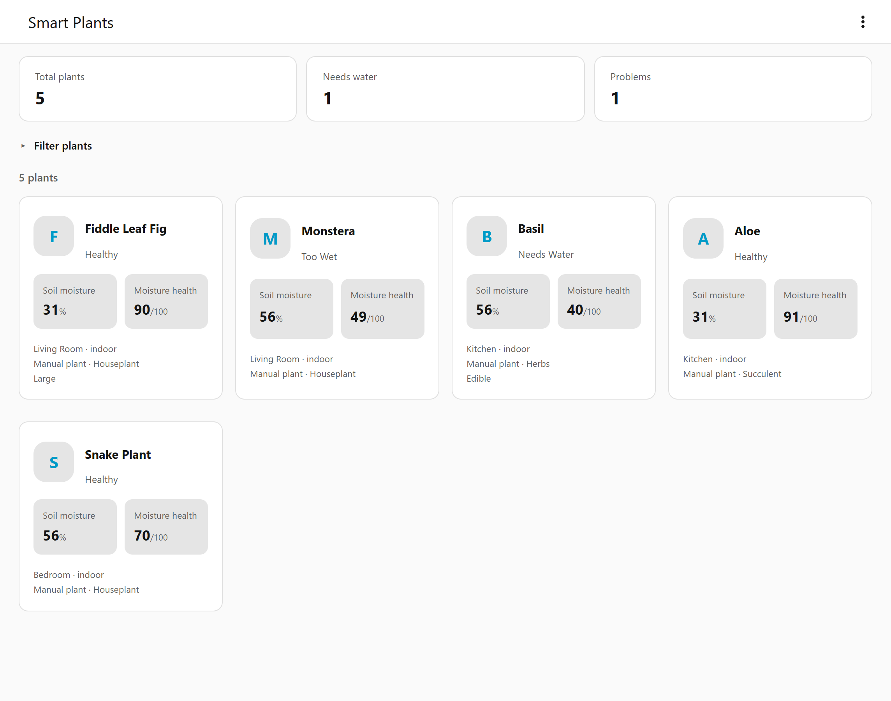

# Smart Plants for Home Assistant

Manage your plants as first-class Home Assistant objects. Create plants from a guided panel,
pick a species, link the sensors you already have, log care, and use each plant's health in
native Home Assistant automations — no YAML or template sensors required.

> **Status:** early development (0.2). Expect rough edges and make sure your Home Assistant
> backups include Smart Plants data (see [Installation](docs/installation.md#backup-and-restore)).

## Features

- **Plants as stable devices.** Each plant is a long-lived Home Assistant device with its own
  area, photo, and entities. Sensors are replaceable inputs, so a plant keeps its history when
  you swap hardware.
- **Guided panel.** A sidebar panel for creating, filtering, editing, disabling, and deleting
  plants.
- **Sensor roles.** Assign existing sensors for soil moisture, temperature, humidity,
  illuminance, conductivity, soil temperature, CO2, and battery.
- **Health evaluation.** A composite health score plus problem binary sensors such as
  *Needs water*, *Too wet*, *Low light*, *Sensor stale*, and per-role stress, with editable
  thresholds.
- **Care history.** Log watering, fertilizing, pruning, repotting, and notes.
- **Optional species data.** Search [OpenPlantBook](https://open.plantbook.io/) and review
  suggested values before applying them. Smart Plants works fully without it.
- **Native Home Assistant integration.** Entities work in any automation, dashboard, or
  notification. Repairs issues guide you when an assigned sensor disappears, and diagnostics
  help with bug reports.
- **Safe by design.** Smart Plants detects plant needs but never switches valves or pumps
  itself. You decide how to act in your own automations.
- Setup, entity names, repairs, and the sidebar panel are available in English and German.

## Requirements

- Home Assistant **2026.8.0** or newer.
- Optional: an OpenPlantBook account with API client credentials.

## Installation

1. In HACS, open **⋮ → Custom repositories**, add
   `https://github.com/mikekuss/home-assistant-smart-plants` with category **Integration**
   (or use the button above).
2. Download **Smart Plants** and restart Home Assistant.
3. Add the integration:

   

4. Open **Smart Plants** in the sidebar and add your first plant.

Manual installation, updating, and removal are covered in [docs/installation.md](docs/installation.md).

## Documentation

- [Installation, updates, backup and restore](docs/installation.md)
- [Getting started](docs/getting-started.md)
- [Sensors and plant health](docs/sensors-and-health.md)
- [Entities](docs/entities.md)
- [OpenPlantBook](docs/openplantbook.md)
- [Automation examples](docs/automations.md)
- [Troubleshooting](docs/troubleshooting.md)
- [FAQ](docs/faq.md)

## Getting help

- Check [Troubleshooting](docs/troubleshooting.md) and the [FAQ](docs/faq.md).
- Report bugs in [GitHub issues](https://github.com/mikekuss/home-assistant-smart-plants/issues)
  and attach the integration's diagnostics download.

## Contributing

Contributions are welcome. See [CONTRIBUTING.md](CONTRIBUTING.md) for the development setup.

## License

[MIT](LICENSE). The bundled panel includes [Lit](https://lit.dev/) (BSD-3-Clause); see
[THIRD_PARTY_LICENSES.txt](custom_components/smart_plants/frontend/THIRD_PARTY_LICENSES.txt).

Smart Plants is not affiliated with or endorsed by Home Assistant, Nabu Casa, or OpenPlantBook.
