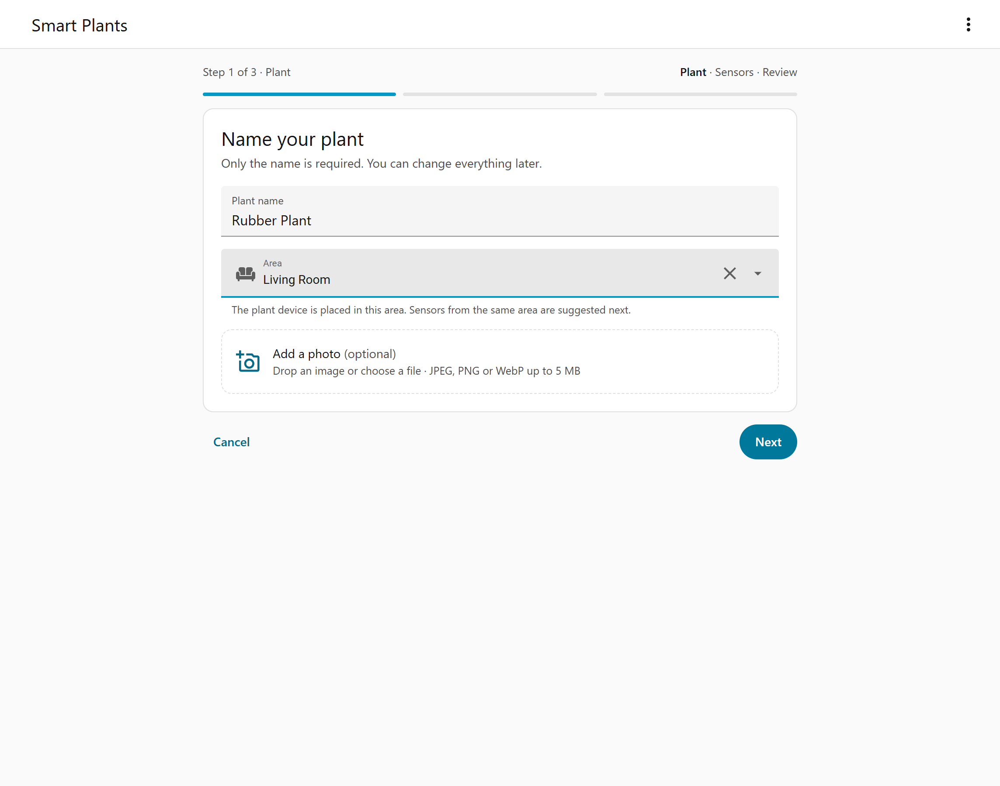
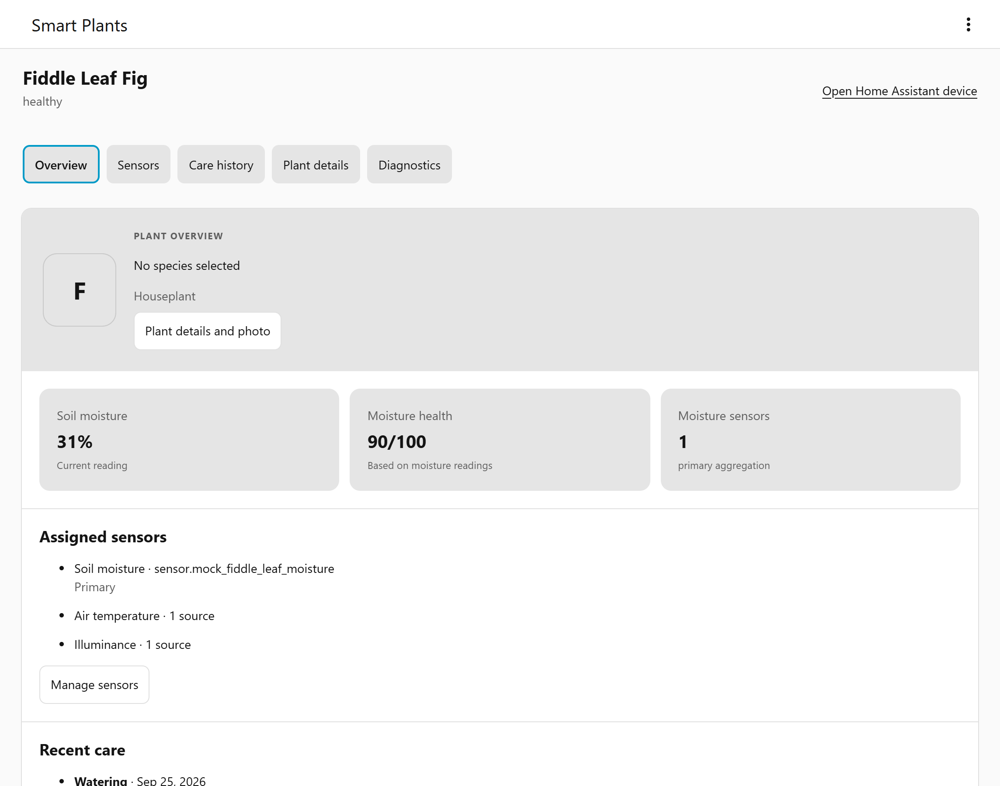

# Getting started

This guide walks you through the Smart Plants panel: creating your first plant, assigning
sensors, adjusting thresholds, logging care, and managing plants over time.

## The Smart Plants panel

After you [add the integration](installation.md#add-the-integration), **Smart Plants**
appears in the Home Assistant sidebar (sprout icon). The panel is available to
**administrator** accounts only; non-admin users don't see it.

The overview shows:

- four summary tiles: **All plants**, **Needs water**, **Problems** (too wet, or another
  reading outside its target such as too little light or a low sensor battery) and
  **Sensor issues** (no recent data, or no soil moisture sensor assigned). Select a tile to
  show only those plants; select it again to show all plants.
- a search field that matches plant name, area, species, category and tags, and a sort menu:
  **Needs attention first** (the default), **Name**, or **Group by area**.
- one card per plant with its photo, area and species, a status label with a short
  explanation (for example *Soil moisture 34% is below the minimum of 60%*), the soil
  moisture on a bar with its target range, the current value of every other assigned
  sensor, and when the plant was last watered.

Each plant has one status, most urgent first: *Needs water*, *Too wet*, a named problem
(such as *Too little light* or *Battery low*), *No recent data*, *No sensors*, *Healthy*.
Paused plants show *Paused*.

Select **Watered** on a card to log a watering right now. A message confirms it and offers
**Undo** for a few seconds.

Use **Add plant** at the bottom right (or **⋮ → Add plant** in the top bar) to start the
creation wizard. Select a plant's name to open its detail view. The **⋮** menu also links to
the integration options and this documentation.

## Create your first plant

The wizard has three steps. It saves nothing until you select **Create plant**, and you can
go back at any time without losing your entries. Only the name is required.

1. **Plant** – Enter a name and optionally choose a Home Assistant **Area**. The plant's
   device is placed in that area, and sensors from the same area are suggested in the next
   step. You can also add a photo: drop an image on the photo field or choose a file (JPEG,
   PNG, or WebP up to 5 MB). It is uploaded right after the plant is created.
2. **Sensors** – Pick a **Soil moisture sensor**; it gives the plant its watering alerts. The
   list only shows moisture sensors, with their current values. Under **Suggested from**
   *area*, other sensors from the chosen area are listed with what they measure and their
   current value; select **Add** to use one. **Add another sensor** lets you pick a sensor for
   temperature, humidity, light, fertilizer level, soil temperature, CO₂, or battery. The
   button reads **Skip for now** until you choose a sensor; you can add sensors later.
3. **Review** – Check the summary and use **Edit** to change a step. Without a soil moisture
   sensor, a warning reminds you that there are no watering alerts. Two optional sections
   hold everything else:
   - **Species and watering targets** – Search [OpenPlantBook](openplantbook.md) (at least
     three characters), pick a result, check the imported information, and tick
     **I reviewed and accept this species information**. Nothing is applied without this.
     If OpenPlantBook is not set up, the section explains where to add its credentials. You
     can also type a common and scientific name yourself. The soil moisture targets
     **Needs water below**, **Ideal**, and **Too wet above** show the Smart Plants defaults,
     or the species values once accepted; change a value to override it for this plant.
   - **More details** – Date acquired, placement (indoor, outdoor, balcony, greenhouse,
     covered outdoor, or dormant storage), category, and tags. Sun exposure, rain exposure,
     and container can be set later on the plant page under **Settings** →
     **More details**.

   Select **Create plant**.

Smart Plants creates one Home Assistant device for the plant, with its moisture and health
entities and every sensor you picked, in a single step. Each picked sensor becomes the main
sensor for its reading, so values show up right away. The confirmation offers **Open plant**,
**Back to plants** and **Add another plant**.

If the connection drops while the plant is being created, the wizard keeps the request and
offers **Retry same creation request**. Retrying never creates a second plant.

## The plant page

Select a plant on the overview to open its page. The header shows the photo, name, area,
species, the plant's status with every current reason, and up to four key readings with
their target range. Two buttons sit next to it:

- **Watered** logs a watering right now, with **Undo** in the notification.
- **Log care** opens the care form in the **Care** tab.

The **⋮** menu in the top bar offers **Open device**, **Download diagnostics**,
**Pause monitoring** (or **Resume monitoring**) and **Delete plant**. The back arrow returns to
the overview.

The page has four tabs:

- **Overview** – *Readings* (each assigned reading with its sensor, whether it is in range,
  too low, too high or not updating, and its target), *Recent care* (the last three entries),
  *About this plant* (species, area, placement, date acquired, category and tags) and
  *Automations* (links to the device page and to a new automation for this device).
- **Sensors** – the sensors in use, the settings for readings with several sensors, and
  *Troubleshooting*.
- **Care** – the care log.
- **Settings** – name, area, photo, species, soil moisture targets, other targets, more
  details, and pausing or deleting the plant.

## Assign sensors

Open the plant and go to the **Sensors** tab.

- **Assigned sensors** lists every sensor the plant uses by its Home Assistant name, with its
  current value and when it last reported. The **⋮** menu of a sensor changes the sensors of
  that reading, makes it the main sensor when a reading has several, or removes it from the
  plant.
- **Add sensor** lists the readings that have no sensor yet: soil moisture, temperature,
  humidity, light, battery, fertilizer level (conductivity), soil temperature and CO₂. Pick
  one, add one or more sensors and save.
- **Several sensors for one reading** (collapsed) sets, per reading, which value counts when
  more than one sensor is assigned (**Main sensor only**, **Average**, **Lowest** or
  **Highest**), which sensor is the **Main sensor**, and after how many seconds without an
  update a sensor counts as **not updating**.

When the soil moisture sensor stops reporting, a warning at the top of the tab names the
sensor and when it last reported.

The sensor picker is filtered by device class and unit for each reading. Tick
**Show all sensors** to pick anything else, or type an entity ID and press Enter to assign a
sensor that is currently unavailable. Each reading accepts up to 32 sensors.

A reading's sensor and problem entities appear the first time you assign a sensor to it. See
[Sensors and health](sensors-and-health.md) for accepted units and how values are combined.

## Edit thresholds

Open the plant and go to the **Settings** tab.

- **Soil moisture targets** – **Needs water below**, **Ideal** and **Too wet above**. The card
  says whether the values come from the species or from the Smart Plants defaults. Leave a
  field empty to use the default, or select **Reset to defaults**, then **Save targets**. The
  plant's *Moisture minimum*, *Moisture target* and *Moisture maximum* number entities change
  the same values.
- **Other targets** (collapsed) lists each configured check other than soil moisture (for
  example *Temperature stress* or *Low battery*) with its current limits. Select
  **Edit thresholds**, change values, and **Save thresholds**. **Inherit all built-in
  defaults** resets that check.

The editors validate the order of values (for example, the "clear" value must sit between
the trigger value and the normal range) before saving. Built-in defaults are listed in
[Sensors and health](sensors-and-health.md#built-in-thresholds).

## Log care

Open the plant and select **Log care** in the header or in the **Care** tab. Choose a care
type, set the date and time (your local time, not in the future), fill in the optional
details, and select **Record care**. The chips above the list (All, Watering, Fertilizing,
Pruning, Repotting, Notes) filter the entries.

| Care type | Details you can record |
| --- | --- |
| Watering | Note |
| Fertilizing | Product, amount with unit (g or mL), note |
| Pruning | Part pruned, note |
| Repotting | Container, medium, note |
| Note | Text (required, up to 1000 characters) |

Notes can be up to 500 characters and other details up to 120. The **⋮** menu of an entry
edits or deletes it. Each plant keeps up to 256 care entries.

Logging a **watering** pauses the plant's *Needs water* alert for 24 hours from the time you
entered, giving the soil sensor time to catch up. See
[Sensors and health](sensors-and-health.md#manual-watering-grace).

## Plant photos

Add or change a photo in the **Settings** tab under **Photo** (or during creation).

- Formats: JPEG, PNG, or WebP.
- Maximum file size: 5 MiB.
- Maximum dimensions: 2048 × 2048 pixels. Larger images are rejected, not resized, so scale
  them down first.

Smart Plants re-encodes every photo to WebP and strips metadata such as EXIF (including
location data) before storing it locally. Photos are only served to logged-in administrators.
Select **Remove photo** to delete it.

## Edit plant details

The **Settings** tab lets you change the name (**Rename**), the Home Assistant area
(**Change area**) and the species. Placement, date acquired, category and tags are under
**More details**. Renaming a plant also renames its Home Assistant device; the entity IDs stay
the same. The area is the same one shown on the device page in Home Assistant.

If another browser session saves changes to the same plant while you are editing, the panel
pauses saving and shows what changed, so you don't overwrite each other.

## Pause, resume, or delete a plant

In the **Settings** tab under **Manage**, or from the **⋮** menu:

- **Pause monitoring** stops evaluation for the plant. Its entities stay registered but become
  unavailable, and its history is kept. Use this for plants in storage or temporarily without
  sensors.
- **Resume monitoring** starts evaluation again.
- **Delete plant** permanently removes the plant, its device and entities, its photo, and its
  care history. You are asked to confirm first. This cannot be undone.

Automations you wrote are never changed by Smart Plants. After deleting a plant, update any
automations that used its entities.

## Next steps

- [Sensors and health](sensors-and-health.md) – how values and problems are calculated.
- [Entities](entities.md) – what each plant exposes to Home Assistant.
- [Automations](automations.md) – notification and irrigation examples.
